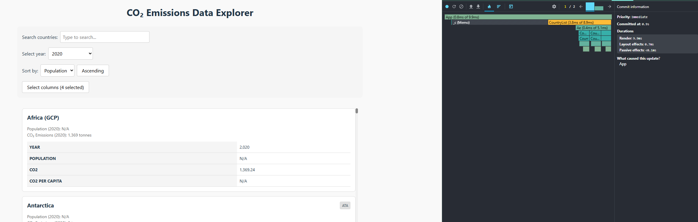
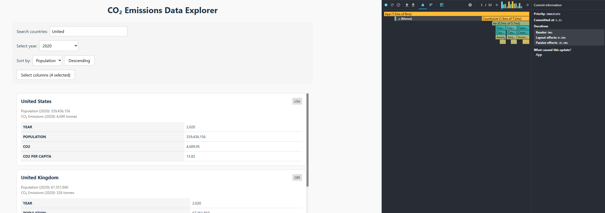
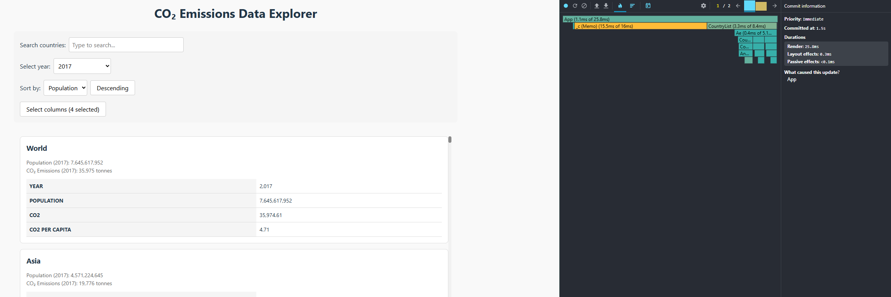
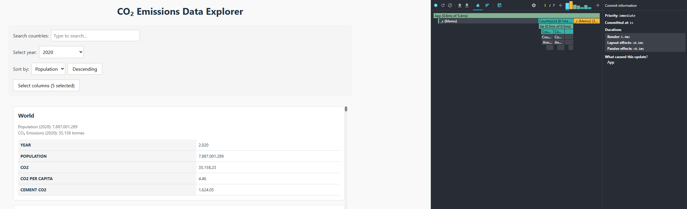

# Report to performance optimization

## Basic measurements

### Interaction A: Sort countries

  - Commit duration: 1.8s
  - Render duration: 228.5ms
  - Screenshot:
  

### Interaction B: Search countries

  - Commit duration: 1.8s
  - Render duration: 101.2ms
  - Screenshot:
  

### Interaction C: Change Year

  - Commit duration: 2.8s
  - Render duration: 246.2ms
  - Screenshot:
  

### Interaction D: Toggle column

  - Commit duration: 1.5s
  - Render duration: 223.1ms
  - Screenshot:
  

## Optimized measurements

### Interaction A: Sort countries

  - Commit duration: 0.9s
  - Render duration: 9.9ms
  - Screenshot:
  

### Interaction B: Search countries

  - Commit duration: 1.2s
  - Render duration: 9ms
  - Screenshot:
  

### Interaction C: Change Year

  - Commit duration: 1.5s
  - Render duration: 25.8ms
  - Screenshot:
  

### Interaction D: Toggle column

  - Commit duration: 1s
  - Render duration: 5.4ms
  - Screenshot:
  

  ## Summary of Improvements

| Interaction      | Baseline (ms) | Optimized (ms) | Improvement |
| ---------------- | ------------- | -------------- | ----------- |
| Sort countries   | 228.5ms       | 9.9ms          | 95.7%       |
| Search countries | 101.2ms       | 9ms            | 91.1%       |
| Change year      | 246.2ms       | 25.8ms         | 89.5%       |
| Toggle column    | 223.1ms       | 5.4ms          | 97.6%       |
| **Average**      | 200           | 12.5           | **93.7%**   |