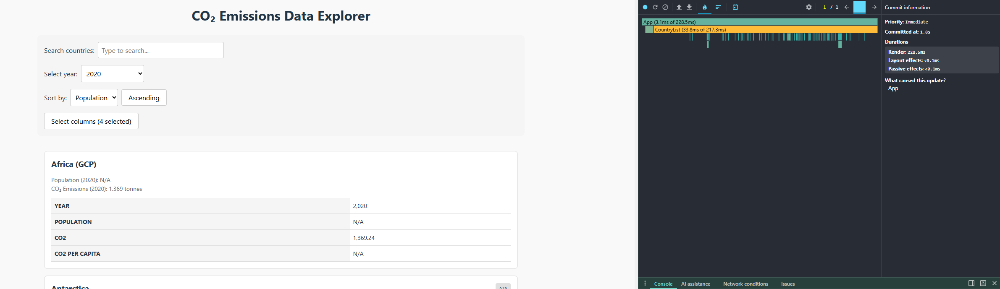
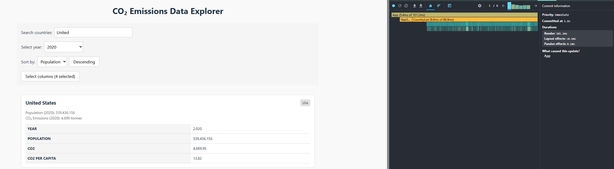
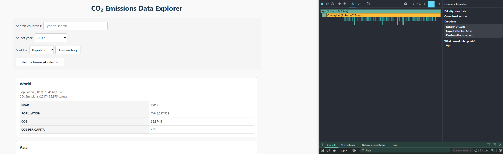
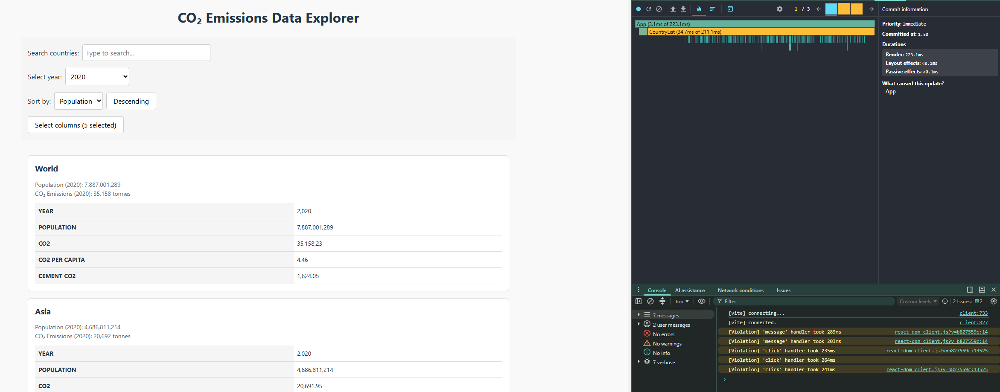

# Report to performance optimization

## Basic measurements

### Interaction A: Sort countries

  - Commit duration: 1.8s
  - Render duration: 228.5ms
  - Screenshot:
  

### Interaction B: Search countries

  - Commit duration: 1.8s
  - Render duration: 101.2ms
  - Screenshot:
  

### Interaction C: Change Year

  - Commit duration: 2.8s
  - Render duration: 246.2ms
  - Screenshot:
  

### Interaction D: Toggle column

  - Commit duration: 1.5s
  - Render duration: 223.1ms
  - Screenshot:
  

